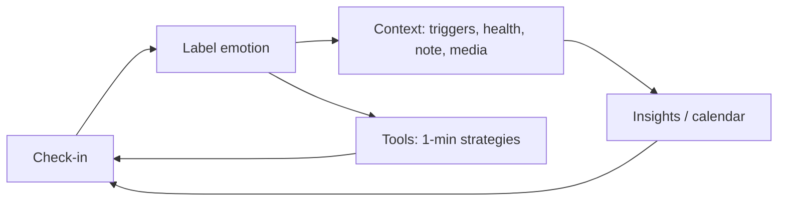

# How We Feel — UIX / UX reference (emotional wellbeing journal)

**Purpose:** Reusable notes for product, UI, and copy when building something *inspired by* (not copying) How We Feel.  
**Product:** Free nonprofit app — “An emotional wellbeing journal” ([App Store](https://apps.apple.com/app/how-we-feel/id1562706384), [howwefeel.org](https://howwefeel.org/)).

**Sources:** Official site and store listings; public case studies (Metalab, designer portfolios); third-party UX walkthroughs (e.g. ScreensDesign). Verify details against live app before shipping.

---

## 1. Product positioning (voice & promise)

| Dimension | What they communicate |
|-----------|------------------------|
| **Tagline / category** | “A journal for your wellbeing” / “An emotional wellbeing journal” |
| **Who built it** | Scientists, designers, engineers, therapists; Yale Center for Emotional Intelligence; Marc Brackett’s work; team led by Ben Silbermann (per [howwefeel.org](https://howwefeel.org/)) |
| **Price / model** | Free; nonprofit; “made possible by donations” (reduces trust friction vs ads / paywalls) |
| **Privacy** | Data on device by default; clear, plain-language terms; optional opt-in to anonymized research ([App Store](https://apps.apple.com/app/how-we-feel/id1562706384)) |
| **Outcomes promised** | Name emotions precisely → spot patterns → regulate *in the moment*; optional sharing with trusted people (“Friends”) |

**Copy patterns to reuse (tone, not literal text):**

- Short headline + three benefit pillars (check-in → patterns → help now).
- Lead with *agency* (“help yourself”, “strategies that work for you”).
- Science as *credibility*, not jargon wall.

---

## 2. Core user loop (UX architecture)

1. **Daily check-in** — primary habit; first-run onboarding teaches by *doing* a check-in (learn-by-doing).
2. **Progressive disclosure** — avoid dumping 100+ emotion words at once; narrow by model first, then specifics. (Same principle as mobile “80/20 first”: show the small set of actions that cover most sessions; hide depth behind one intentional tap with a **descriptive** label, not generic “Voir plus”. See [Affective on progressive disclosure](https://weareaffective.com/learning-centre/how-can-i-use-progressive-disclosure-in-mobile-app-design).)
3. **Immediate regulation** — after logging, surface short video/step strategies (seconds to ~1 minute).
4. **Reflection over time** — calendar, trends, correlations with lifestyle/health where integrated (e.g. HealthKit on iOS).

---

## 3. Information architecture (inferred screens / areas)

| Area | Role | UX notes |
|------|------|----------|
| **Onboarding** | Trust + teach core loop | Privacy early; nonprofit/donation framing; first task = real check-in |
| **Check-in / Mood Meter** | Heart of the app | Quadrant model → granular labels; color as semantic (energy × valence) |
| **Journal / history** | Past entries | Labels, optional notes, photos, voice; scannable list |
| **Analyze / patterns** | Motivation to continue | Calendar view, trends, correlations (sleep, exercise, etc. where available) |
| **Tools / strategies** | Coping library | Categories: thinking, body, mindfulness, social; short-form media |
| **Friends** | Optional social layer | Controlled sharing (e.g. codes); real-time “how I feel” with trusted people |
| **Settings** | Control & safety | iCloud sync, deletion, research opt-in (per public descriptions) |

---

## 4. Key UX patterns (steal the *pattern*, redesign the *chrome*)

### 4.1 Guided emotion labeling (Mood Meter / circumplex)

- **Model:** Two axes — typically **energy** (high/low) and **pleasantness** (pleasant/unpleasant) → four quadrants.
- **UI metaphor:** “Wheel” or meter; **many precise words** (public sources cite ~100–144 labels) as **bubbles** or chips *within* the chosen region — not one giant flat list.
- **Why it works:** Turns abstract “how do you feel?” into a **spatial, low-language** task first, then **vocabulary** second.

**Reuse checklist:**

- [ ] Two-axis or equivalent “zoom in” before word pick
- [ ] Color encodes quadrant meaning consistently
- [ ] Neutral / middle feelings explicitly supported (user reviews often ask for “neutral”)

### 4.2 Learn-by-doing onboarding

- First meaningful action = **core loop** (check-in), not feature tour only.
- Pair with **privacy** and **why we exist** in the first minute.

### 4.3 Actionable tools after identification

- **Buckets** aligned to regulation *modes*: e.g. cognitive, somatic, mindfulness, interpersonal (names in store: “Change Your Thinking”, “Move Your Body”, “Be Mindful”, “Reach Out”).
- **Format:** Step-by-step, **very short** time commitment (“as little as one minute”) to lower barrier after an emotional moment.

### 4.4 Metaphor-driven exercises (differentiation)

- Example from public UX reviews: **“Burn the Negative”** — strong visual metaphor for releasing self-talk.
- **Reuse idea:** One or two *memorable* embodied interactions, not only lists and charts.

### 4.5 Analytics that feel personal

- Connect logged state to **context**: sleep, movement, triggers, time of day (where product integrates health data).
- **Risk (from reviews):** Dense analytics UI; mixed chart types; not all views feel actionable — opportunity to **prioritize fewer, clearer** insights.

### 4.6 Social: opt-in, bounded trust

- Friends via **invite/code**; share current state with **chosen** people — not open social network by default.

### 4.7 Contextual permissions (camera, gallery, mic, notifications)

When a wellbeing app adds **photo, voice, or live capture**, permission UX drives trust as much as the privacy policy.

- **Ask in context**, not at cold launch: request access when the user taps the action that needs it (camera when they choose “take photo”, not on first splash). Users refuse less when the system dialog is preceded by a clear *benefit* line (“So you can attach a moment to this entry”) rather than a feature dump (“We need camera access”). See [BAM Tech — camera checklist](https://www.bam.tech/en/article/the-essential-checklist-for-integrating-camera-functions-in-mobile-apps) and common progressive-permission writeups (e.g. [permission microcopy patterns](https://medium.com/@riyajawandhiya/permission-microcopy-why-the-users-always-say-no-and-how-to-fix-it-74d1d27af0ed)).
- **Recovery if denied**: always offer an alternate path (e.g. pick from gallery, skip media, “open Settings” deep link) and non-punitive copy (“Pas de souci — vous pouvez quand même…”).
- **Immediate feedback** after capture (haptic, flash, thumbnail) so the device feels responsive even if upload or analysis is slower.

---

## 5. Visual & UI language (inferred)

| Element | Direction |
|---------|-----------|
| **Color** | Quadrant-coded; warm/cool differentiation by valence and energy; friendly, not clinical “hospital UI” |
| **Shape** | Rounded bubbles, soft cards; journal-like warmth |
| **Typography** | Approachable; marketing site uses bold split headlines (“Check in to track / your emotions”) |
| **Motion** | iOS updates mention “liquid glass” style effects (Apple platform trend) — polish and depth, not gimmick-first |
| **Iconography** | Abstract/colorful mood glyphs on calendar (per screenshot galleries) |

---

## 6. Content & microcopy principles

- **Precise words** over generic sliders (“good/bad”).
- **Micro-commitments:** “one minute” strategies.
- **Plain-language privacy:** what stays on device, what is optional, what research means.
- **Non-judgmental framing:** curiosity and regulation, not moral scoring of “bad” moods.

---

## 7. Accessibility & inclusion (gaps to improve in derivatives)

- App Store listings have noted **undeclared accessibility** features at times — any serious clone should **declare** VoiceOver, Dynamic Type, contrast, reduced motion.
- Age band (e.g. 9+) implies copy and imagery stay appropriate for teens and adults.

### 7.1 Touch targets (WCAG 2.2, December 2024 REC)

- **[SC 2.5.8 Target Size (Minimum), Level AA](https://www.w3.org/WAI/WCAG22/Understanding/target-size-minimum.html):** pointer targets must be at least **24×24 CSS px** (or meet the spacing exception so 24px circles on adjacent undersized targets do not overlap). This is the legal minimum for WCAG 2.2 AA conformance.
- **[SC 2.5.5 Target Size (Enhanced), Level AAA](https://www.w3.org/WAI/WCAG22/Understanding/target-size-enhanced.html):** **44×44 CSS px** where feasible. W3C’s own “Understanding” text recommends considering 2.5.5 for important controls even when you only target AA.
- **Practical takeaway for emotional apps:** users often tap one-handed, on transit, or with reduced dexterity; **treat 44×44 as the design default** for primary actions (check-in, save, “done”), and use AA spacing rules only for dense secondary controls (inline text links, chip grids).

### 7.2 Focus, motion, and cognitive load (WCAG 2.2 highlights)

- **Focus Not Obscured (2.4.11 AA / 2.4.12 AAA):** sticky bars, bottom sheets, and keyboard focus rings must not hide the focused element. Wellbeing flows use many overlays; test tab order with real keyboards and VoiceOver/TalkBack.
- **Dragging Movements (2.5.7 AA):** if you use drag-only controls (sliders, mood wheels), provide a **single-pointer** alternative unless dragging is essential.
- **`prefers-reduced-motion`:** respect system setting for parallax, large transitions, and celebratory animations after check-ins.

### 7.3 Dark UI and long reading (typography + contrast)

- **WCAG still applies in dark mode:** normal text **4.5:1**, large text **3:1**, non-text UI **3:1** against adjacent colors ([WCAG 2.2](https://www.w3.org/TR/2024/REC-WCAG22-20241212/)). Meeting the ratio is necessary but not sufficient for comfort.
- **Nielsen Norman Group** notes dark-mode legibility issues from **overly thin**, **overly bold**, and **low-contrast** type; saturated hues on near-black can read as “vibrating” even when a contrast checker passes ([Dark mode: how users think about it](https://www.nngroup.com/articles/dark-mode-users-issues/)).
- **Industry practice (Material / Apple-style “soft black”):** avoid **pure white (#FFF) on pure black (#000)** for long reading blocks; use **off-white body** (~`#E0E0E0`–`#EDEDED`) on **raised dark surfaces** (~`#121212`–`#1E1E1E`) to reduce halation for users with astigmatism and for OLED night reading. You can still use true black for chrome or branding, but **keep body copy off pure white** and re-check **muted** grays on **secondary** surfaces (they fail more often than designers expect).

---

## 8. Competitive differentiators (for your PRD / design brief)

1. Science + nonprofit + no paywall = **trust stack**.  
2. **Vocabulary breadth** + **progressive** selection = depth without overwhelm.  
3. **Regulation** integrated in-product, not only logging.  
4. **Privacy default** + explicit research opt-in.  
5. **Optional** intimate sharing, not performative social feed.

---

## 9. Known friction (from public reviews — design opportunities)

- Desire for **neutral** mood / center-of-meter emotions.
- **Analyze** tab: chart consistency, percentage vs mixed formats, “useful vs noise” density.
- **Rich media** on entries (photos) — reliability over time if you add similar features.

---

## 10. Science / pedagogy hooks (for onboarding or “Learn” sections)

- **RULER** (Recognize, Understand, Label, Express, Regulate) — referenced in design case studies collaborating with Yale / Metalab-style work ([bpowell.co case study](https://www.bpowell.co/design/how-we-feel)).
- **Circumplex / Mood Meter** — decades of emotion research; Marc Brackett / Yale CEI lineage ([marcbrackett.com](https://marcbrackett.com/how-we-feel-app-3/), [themoodmeter.com guide](https://www.themoodmeter.com/the-how-we-feel-app-harnessing-emotional-awareness-for-a-healthier-mind/)).

---

## 11. Links (bookmark)

| Resource | URL |
|----------|-----|
| Official project | https://howwefeel.org/ |
| iOS App Store | https://apps.apple.com/app/how-we-feel/id1562706384 |
| Google Play | https://play.google.com/store/apps/details?id=org.howwefeel.moodmeter |
| Marc Brackett — app context | https://marcbrackett.com/how-we-feel-app-3/ |
| UX walkthrough / highlights (third party) | https://screensdesign.com/showcase/how-we-feel |
| Design collaboration notes (third party) | https://www.bpowell.co/design/how-we-feel |
| Mood Meter app guide (third party) | https://www.themoodmeter.com/the-how-we-feel-app-harnessing-emotional-awareness-for-a-healthier-mind/ |
| WCAG 2.2 (REC) | https://www.w3.org/TR/2024/REC-WCAG22-20241212/ |
| Understanding SC 2.5.8 Target Size (Minimum) | https://www.w3.org/WAI/WCAG22/Understanding/target-size-minimum.html |
| Understanding SC 2.5.5 Target Size (Enhanced) | https://www.w3.org/WAI/WCAG22/Understanding/target-size-enhanced.html |
| NN/g — dark mode legibility | https://www.nngroup.com/articles/dark-mode-users-issues/ |
| Mobile camera UX checklist | https://www.bam.tech/en/article/the-essential-checklist-for-integrating-camera-functions-in-mobile-apps |
| Progressive disclosure (mobile) | https://weareaffective.com/learning-centre/how-can-i-use-progressive-disclosure-in-mobile-app-design |

---

## 12. One-page “brief” for designers (paste into Figma FigJam)

**App:** Emotional wellbeing journal. **Core interaction:** Check-in using a 2D emotion model (energy × pleasantness) → pick a specific feeling word → optional context → see patterns over time → pick a 1-minute regulation strategy. **Trust:** On-device by default, plain privacy, nonprofit/free. **Social:** Optional, invite-only sharing with close contacts. **Visual:** Soft, quadrant color logic, bubbles/chips, calendar of emotional “weather”. **Avoid:** Paywall surprise, dense analytics without narrative, infinite undifferentiated mood list.

---

*Document compiled for reuse in personal projects. “How We Feel” is a trademark of its respective owner; this file is independent documentation and not affiliated with the app.*
